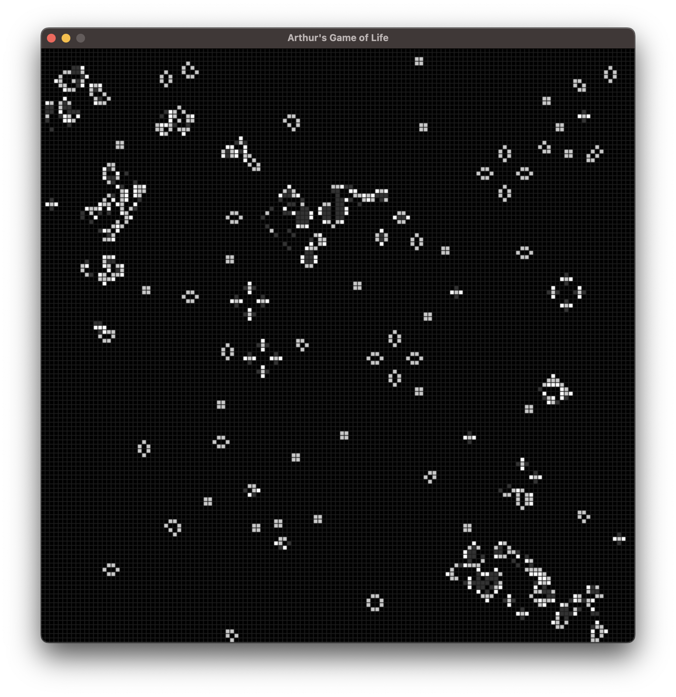
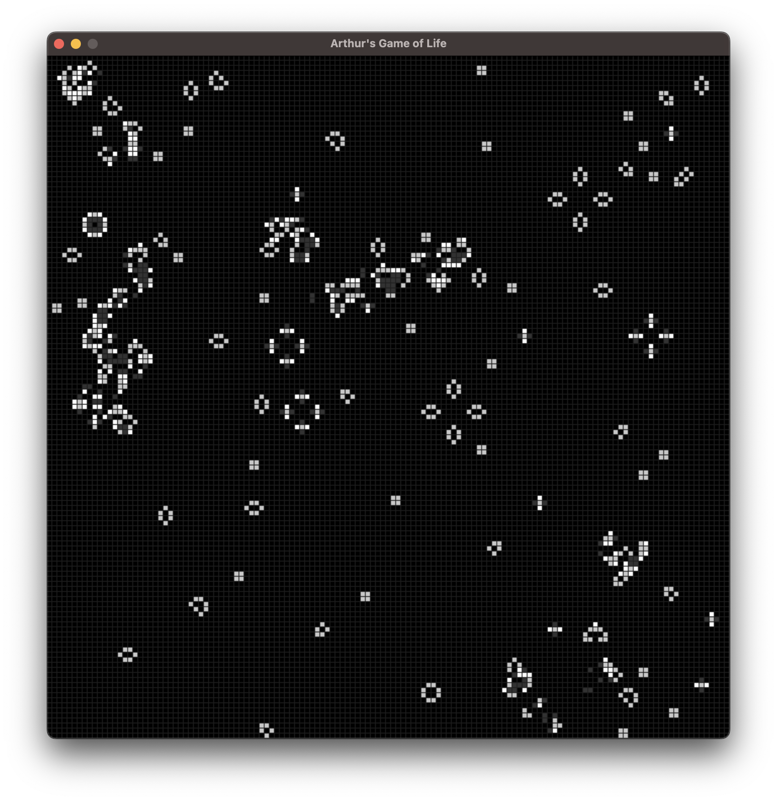
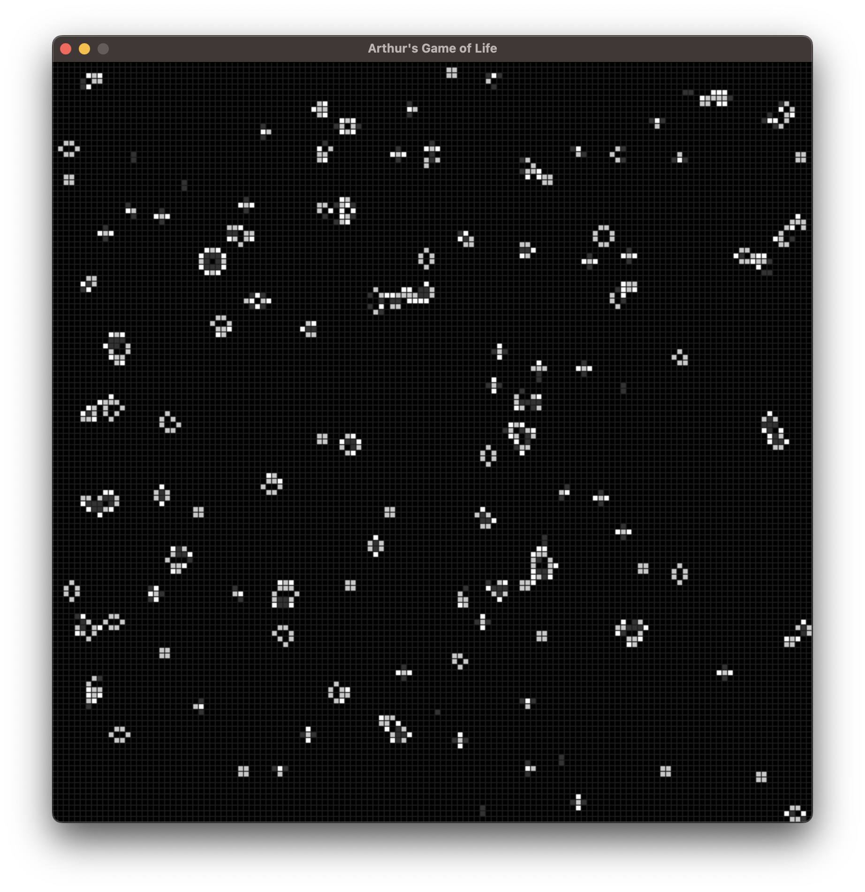

# Introduction to Programming (ETHZ course)
The repository contains the files produced during the coding sessions and exercises of the **Introduction to Programming** course at ETH Zurich. This voluntary programming course offers an introduction to Bash scripting and version control using Git, as well as the programming languages C, MATLAB, R and Python.

The projects tackled in this course include a short analysis of the popular Titanic passenger data set and an analysis of bacterial single-nucleotide polymorphisms (SNPs), as well as an implementation of *Conway's Game of Life*.

**Further details about the projects can be found in their respective project directories.**

## Projects overview

#### 1. &nbsp; `c_code` &nbsp; Introductory C programs
Directory contains the scripts produced during the C coding session and exercises.

#### 2. &nbsp; `matlab` &nbsp; Introductory MATLAB programs
Directory contains the files produced during the MATLAB coding session.

#### 3. &nbsp; `r_code` &nbsp; Introductory R program
Directory contains the R file produced during the R coding session.

#### 4. &nbsp; `python` &nbsp; Titanic and bacterial SNP data set analyses
Directory contains the notebook used during the Python coding session, as well as a short analysis of the popular Titanic data set and an analysis of bacterial single-nucleotide polymorphisms (SNPs).

#### 5. &nbsp; `conway` &nbsp; Conway's Game of Life
Directory contains my implementation of *Conway's Game of Life*, which is a cellular automaton that starts from a random distribution of living cells and then lives on without any user input.

  
  
  

***Figures 1-3:** Example images taken from my implementation of the game at three different time points.*

## Dependencies, installation and usage
Each of the directories in this repository contains a `README.md` file, detailing any dependencies, how to run the files, their usage and additional information about the projects.

## Contributing
If you want to contribute to this project, found any bugs or have new feature ideas, please open an issue!

## License
This project is licensed under the **GNU General Public License v3.0**, allowing you to freely use, modify, and distribute the code. Any derived works must also be licensed under GPL-3.0, promoting open-source collaboration and transparency. Please review the license terms before using or contributing to this project.
