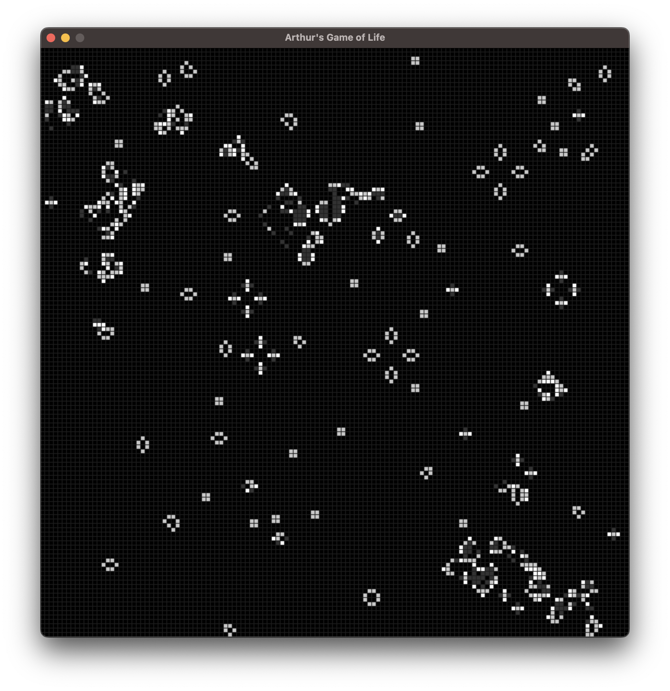
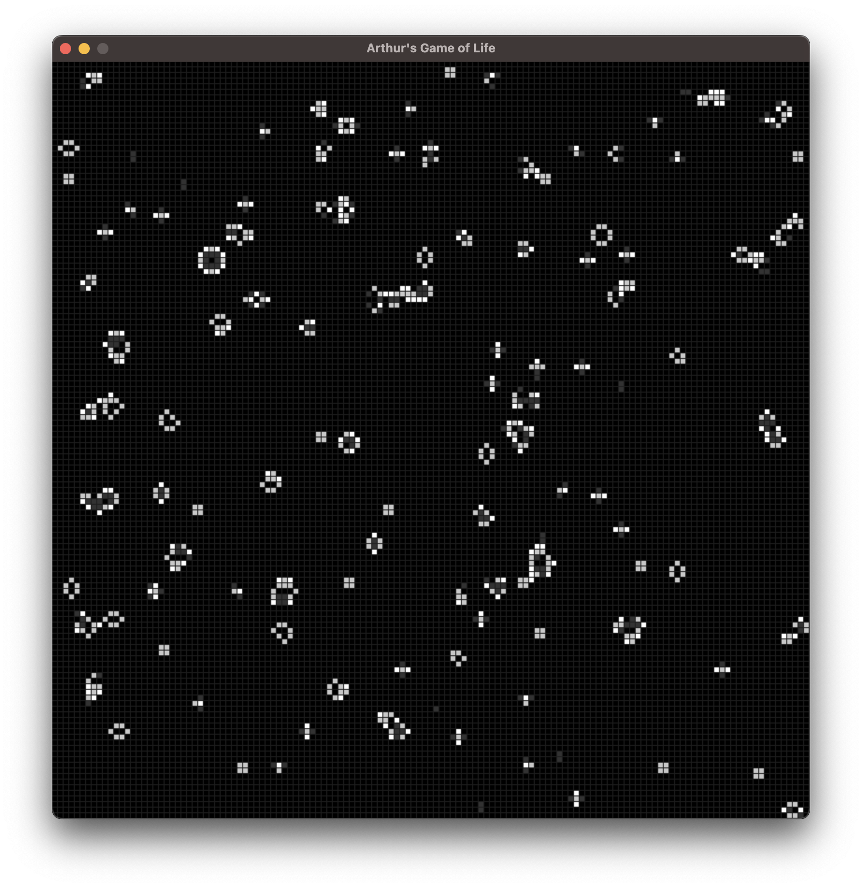

# 5. &nbsp; Conway's Game of Life
This is my own implementation of *Conway's Game of Life*, which is a cellular automaton devised by the British mathematician John Horton Conway in 1970. The game starts with an infinite 2D grid of square cells, each in one of two states: live or dead. The starting pattern is the only input by the user. Each cell interacts with its eight adjacent neighbors (horizontal, vertical, and diagonal). In every time step, the following transitions occur:

1. Any live cell with fewer than two live neighbours dies (underpopulation).
2. Any live cell with two or three live neighbours lives on to the next generation.
3. Any live cell with more than three live neighbours dies (overpopulation).
4. Any dead cell with exactly three live neighbours becomes a live cell (reproduction).

**Please use `game_of_life.py` to run the game!**

The `conway.ipynb` notebook is only meant to explain the program and cannot be closed without crashing the kernel.

## File descriptions
#### `conway.ipynb`
Jupyter notebook explaining my implementation of *Conway's Game of Life*.

#### `game_of_life.py`
Python file to actually run the game.

## Dependencies
This project requires the following Python libraries:
`numpy`
`pygame`

They can be installed using PIP:
```
pip install numpy pygame
```

## Installation
Running this game requires an installation of Python 3 and the libraries mentioned above. To run the game, you can clone the repository to your machine or simply download the `game_of_life.py` and run it with your local installation of Python. The game can be exited by closing the game window.

## Usage
You can customize the initial state and appearance of the world by modifying the following variables in the `game_of_life.py` script:

- `p_alive`: Fraction of living cells at the start (initial probability of a cell being alive).
- `world_x`: Width of the world (number of cells in the horizontal direction).
- `world_y`: Height of the world (number of cells in the vertical direction).
- `size`: Size of the cells (scaling factor).
- `FPS`: Refresh rate (frames per second) for the simulation.

The colors are defined by RGB values and can also be modified directly in the script:
- `BORN`: Color of cells that are born.
- `LIVE`: Color of cells that are alive.
- `FADE`: Color of cells that are dying (living conditions not fulfilled).
- `DEAD`: Color of cells that are dead (background).
- `GRID`: Color of the grid for the cells.

## Example images
<div style="display: flex; flex-wrap: wrap; justify-content: space-between;">
  
  
  
</div>

***Figures 1-3:** The images show different time points after the start of the simulation. Two different random starting positions were used.*

## Contributing
If you want to contribute to this project, found any bugs or have new feature ideas, please open an issue!

## License
This project is licensed under the **GNU General Public License v3.0**, allowing you to freely use, modify, and distribute the code. Any derived works must also be licensed under GPL-3.0, promoting open-source collaboration and transparency. Please review the license terms before using or contributing to this project.
